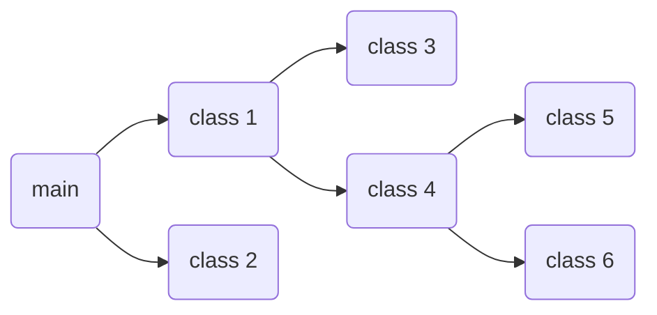
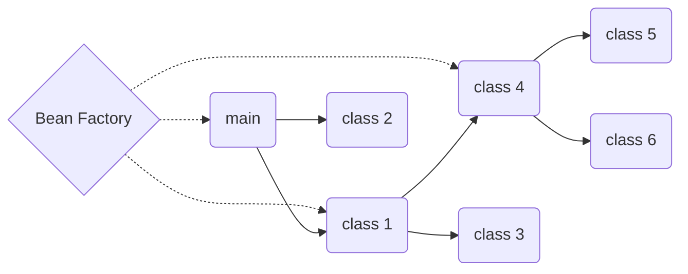

# spring framework
## why spring?
- provides patterns and structures to rapidly build applications
- solves common problems by providing
	- application context and dependency injection
	- data access -> makes working with JDBC easier
	- spring MVC -> lets create web applications
- principles such as OOP(Object Oriented Programming) and DRY(Don't Repeat Yourself) are built into Spring framework
---
# inversion of control (IoC)
## what is IoC?
- **inversion of control** or IoC is a design principle that is used to invert controls in object-oriented design to achieve loose coupling
- for example instead of driving yourself to work, hiring a driver to take you to work would be an example of inverting controls
	- **loose coupling** -> approach to interconnect components in a system so that those components depend on each other, i.e. designing something assuming that it might be replaced  in the future
	- **tight coupling** -> approach where resources are bound together for specific purpose and function, i.e. making something assuming that it will never be replaced in the future
	- example -> turning on a lamp using a plug is an example of loose coupling and hard-wiring the copper straight to the power outlet would be an example of tight coupling

## traditional dependency management
- traditionally, classes had to be properly created and manually managed for the life cycle of the application which can cause problems with large applications
- suppose we have a main class and two dependent classes (class 1 and class 2), so you need to construct those classes when you construct main, however those classes can have more dependent classes (class 3 and class 4) and so forth
- so when you are constructing main, you are constructing many other classes, therefore we are three levels deep into constructing a single class

## dependency injection
- one common problem that IoC solves is **dependency injection** which is basically separating the class which it is dependent upon and injecting from outside when needed
- this principle can be achieved by a container provided by Spring called the **Bean Factory** (aka IoC container) which is responsible for instantiating, configuring, and managing beans
	- rather than creating and maintaining the life cycle of beans, a dependency injected application relies on a Bean Factory to create and maintain all components and inject beans when needed
- a **bean** (aka components) is an instance of a class and are wired together inside the application context and thus have dependencies between them

## IoC dependency management
- in contrast to the traditional dependency management, an IoC dependency management starts with an Bean Factory which is triggered from the main class
- the Bean Factory manages every object in our class and instead of constructing dependent classes, the Bean Factory takes them as constructor arguments and handles the injection at object creation for main
- Bean Factory also handles what order the object must be created (main -> class 1 -> class 4)
- this is much easier to manage since we don't have to dig deep into classes to manage them

---

# application context

## what is application context?
- **application context** acts as a heart of a spring application as it encapsulates the Bean Factory so it also managed beans
- it provides metadata for bean creation, and provides mechanisms for creations of beans in the correct order

## configuration
- an application context can be configured either using a Java based configuration or a XML based configuration, however the latter is less prominent
- **bean scopes** refers to how long does an object lives and how many objects will be created for that bean throughout; following are the types of bean scopes:
	- singleton -> the default the scope of a bean
	- prototype -> new instance every time it is referenced; once no longer referenced, it is available for garbage collection
	- session -> similar to prototype but only applies to web environment only and only one instance of bean per user session
	- request -> only apply to web environment only and only one instance per request

## proxies
- aspected behaviors that is applied to class by the framework under various conditions
- in Spring everything is a proxy
