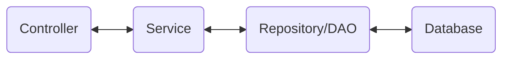

## HTTP methods
- `GET` -> retrieve data
- `POST` -> submit data to be processed 
- `PUT` -> update a data or create it if it does not exist
- `DELETE` -> request the removal of the resource
- `PATCH` -> apply partial modifications to a resource
- `HEAD` -> `GET` but without the body
- `OPTIONS` -> describe the communication options
- `TRACE` -> perform a message loop-back test
- `CONNECT` -> establish a network connection to a resource

---
## HTTP status codes
Code Range | Description 
:---: | :---:
100-199 | informational
200-299 | successful
300-399 | redirection
400-499 | client error
500-599 | server error

---
## JSON data binding
- process of mapping JSON to POJO
- also known as serialization/deserialization
- spring uses Jackson project to handle JSON data binding

---
## controller
- `@Controller` -> specialization of `@Component` which auto-detects implementation classes through class path scanning
- `@ResponseBody` -> provides automatic serialization of the return object into the `HttpResponse`
- `@RestController` -> includes `@Controller` and `@ResponseBody` annotation
- `@RequestMapping` -> used to map web requests to spring controller methods
```java
@RestController
@RequestMapping("/test")
public class DemoRestController() {

	// can be accessed at /test/hello
	@GetMapping("/hello")
	public String sayHello() {
		return "Hello World!";
	}
}
```
- `@PathVariable` -> 
	- use parameters to handle data
	- note that the parameter has to match the argument
```java
@GetMapping("/students/{studentId}")
public Student getStudentById(@PathVariable int studentId) {
	return students.get(studentId);
}
```

---
## service
- intermediate layer for custom business logic

- `@Service` -> specialization of `@Component` 
- best practice is to apply transactional boundaries at the service layer

---
## exception handling
- you can send back custom error message
```java
public class StudentErrorResponse {  
    private int status;  
    private String message;  
    private long time;
    // no-args, all-args, getter, setter
```
- you can throw error and handle them
```java
@GetMapping("/students/{id}")  
public Student getStudentById(@PathVariable int id) {  
    if(id > students.size() || id < 0)  
       throw new StudentNotFoundException("Student " + id + " not found");  
    return students.get(id);  
}
```
- throw custom error by extending `RuntimeException`
```java
public class StudentNotFoundException extends RuntimeException {  
    public StudentNotFoundException(String message, Throwable cause) {  
       super(message, cause);  
    }  
    public StudentNotFoundException(String message) {  
       super(message);  
    }  
    public StudentNotFoundException(Throwable cause) {  
       super(cause);  
    }  
}
```
- use AOP to handle exceptions globally
```java
@ControllerAdvice
public class StudentExceptionHandler {

    @ExceptionHandler
    public ResponseEntity<StudentErrorResponse> handleException(StudentNotFoundException exception) {
        StudentErrorResponse error = new StudentErrorResponse();
        error.setStatus(HttpStatus.NOT_FOUND.value());
        error.setMessage(exception.getMessage());
        error.setTime(System.currentTimeMillis());
        return new ResponseEntity<>(error, HttpStatus.NOT_FOUND);
    }

    @ExceptionHandler
    public ResponseEntity<StudentErrorResponse> handleException(Exception exception) {
        StudentErrorResponse errorResponse = new StudentErrorResponse(
            HttpStatus.BAD_REQUEST.value(),
            exception.getMessage(),
            System.currentTimeMillis()
        );
        return new ResponseEntity<>(errorResponse, HttpStatus.BAD_REQUEST);
    }

}
```

---
## [spring data JPA](https://docs.spring.io/spring-data/jpa/docs/current/api/org/springframework/data/jpa/repository/JpaRepository.html)
- creating a DAO for multiple entities is very similar, so spring data JPA does the work for you
```java
// Employee is the entity type and Integer is the primary key data type
pubic interface EmployeeInterface extends JpaRepository<Employee, Integer> {}
```
- for custom queries follow [this](https://docs.spring.io/spring-data/jpa/reference/jpa/query-methods.html#jpa.query-methods.at-query)
- also note that `JpaRepository` provides `@Transactional` by default, so no need for that in the service layer
- to give a custom path
```java
@RepositoryRestResource(path = "members")
pubic interface EmployeeInterface extends JpaRepository<Employee, Integer> {}
```

---
## spring data REST
- just like spring data JPA, spring data REST leverages the existing `JpaRepository` and provides REST CRUD implementation for free
```xml
<dependency>
    <groupId>org.springframework.boot</groupId>
    <artifactId>spring-boot-starter-data-rest</artifactId>
</dependency>
```
---
