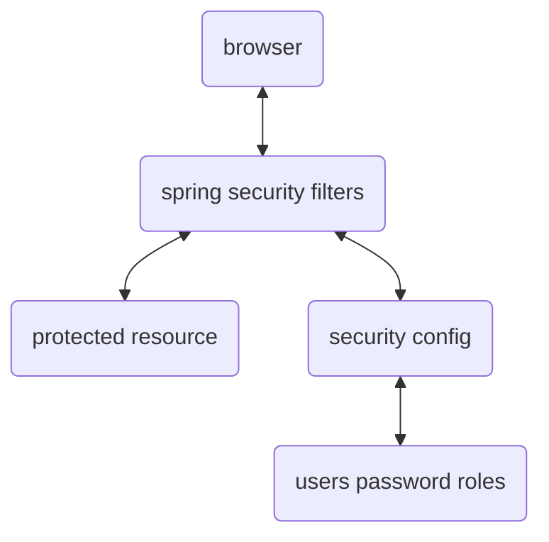

---
- **authorization** -> check user id and password with credentials
- **authorization** -> check to see if user has an authorized role
- **declarative security** -> define application's security constraints in configuration (`@Configuration`)
- **programmatic security** -> extending the existing framework
```xml
<dependency>
    <groupId>org.springframework.boot</groupId>
    <artifactId>spring-boot-starter-security</artifactId>
</dependency>
```
- by default all endpoints are secured 
- by default the username is `user` and password is logged to the logs and to override the them
```properties
spring.security.user.name=scott
spring.security.user.password=pass23
```
- password storage -> `{id}encodedPassword`
	- `noop` -> plain text
	- `bcrypt` -> BCrypt password hashing
---


- encoding -> base64
- encryption -> input to output with a required secret and vice versa
- hashing function -> input to output with a secret; output to input not possible

---
- implemented using servlet filters
- ---
- restricting requests ->
```java
requestMatchers(<http method>, <path>)       // restrict access to a given path
	.hasRole(<authorized role>)

requestMatchers(<http method>, <path>)       
	.hasAnyRole(<list of authorized role>)
```
cross site request forgery